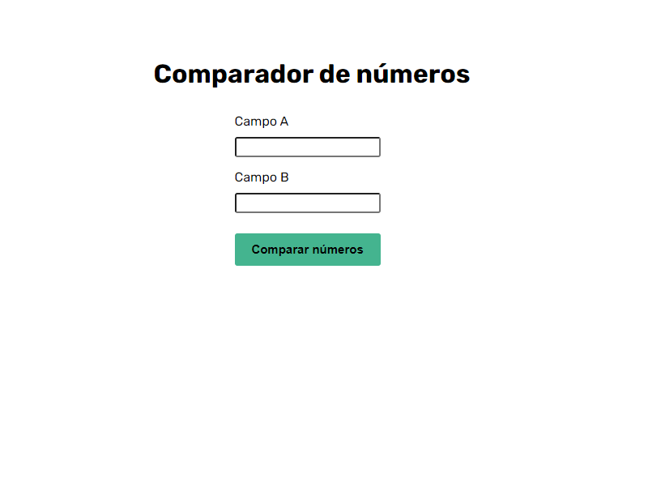
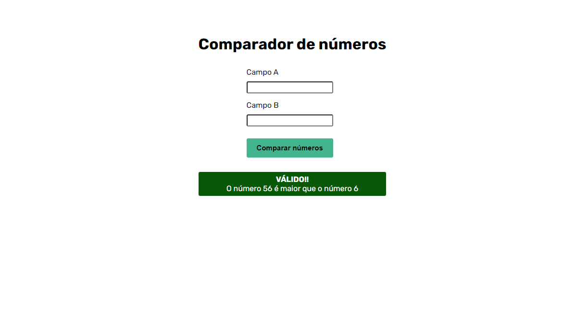
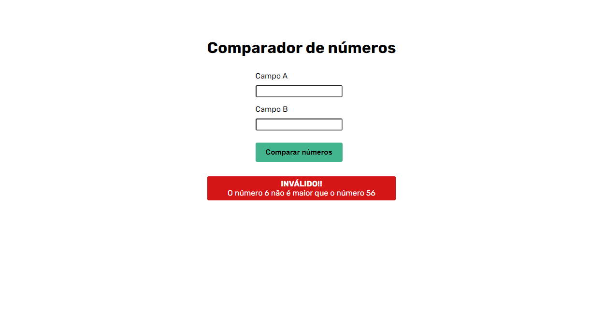

# Number comparator



This application is a study of the use of the DOM to display information on the screen as the user interacts with it. It involves a number comparator: if the number entered in input B is higher than the one entered in input A, a valid message is returned to the user. If the number in input A is higher, an invalid message is returned to the user.

## Index
- <a href="#functionalities">Application functionalities</a>
- <a href="#layout">Layout</a>
- <a href="#demonstration">Demonstration</a>
- <a href="#run">How to run the application</a>
- <a href="#tecnologies-used">Tecnologies used</a>
- <a href="#developer">Developer</a>

## Application functionalities
 - [x]  Comparison between two numbers
 - [x]  Information shown as the user interacts with the application

## Layout
1. Mobile







## Demonstration


https://github.com/Julia-slvbrg/split-the-check/assets/114543081/406c3626-3617-4b42-9066-74a359be5d5c


## How to run the application
```bash
# Clone this repository
$ git clone repolink

# Acess the app folder on your terminal
$ cd for-HTML-DOM  

# Utilize a local server launch tool to view the application in your browser

```

## Tecnologies used
1. HTML
2. CSS
3. DOM
4. Javascript

## Developer
[LinkedIn](https://www.linkedin.com/in/julia-silva-borges/)